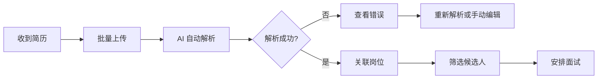

# 简历管理模块快速开始指南

## 目录

1. [功能概览](#功能概览)
2. [环境准备](#环境准备)
3. [快速开始](#快速开始)
4. [使用场景](#使用场景)
5. [常见问题](#常见问题)

---

## 功能概览

简历管理模块提供以下核心功能：

- 📤 **单个/批量上传简历**（支持 PDF、DOC、DOCX、TXT、JSON）
- 🤖 **AI 自动解析**（使用 DeepSeek API 智能提取字段）
- 💾 **原始文件保存**（永久保留，支持下载）
- 🔄 **重新解析**（解析失败可重试）
- 📊 **导入报告**（统计成功率）
- 📝 **操作审计**（完整日志追踪）
- 🔍 **高级搜索**（按状态、岗位、关键词筛选）

---

## 环境准备

### 1. 数据库迁移

运行迁移脚本创建审计日志表：

```bash
cd backend
mysql -u root -p interview < migrations/003_add_resume_audit_logs.sql
```

### 2. 配置 AI 服务

在 `backend/.env` 中配置 DeepSeek API Key：

```env
DEEPSEEK_API_KEY=your-api-key-here
```

或者在 `backend/src/ai/ai.service.ts` 中直接配置：

```typescript
this.openai = new OpenAI({
  baseURL: 'https://api.deepseek.com',
  apiKey: process.env.DEEPSEEK_API_KEY || 'your-key',
});
```

### 3. 启动服务

```bash
# 开发模式
cd backend
pnpm install
pnpm run start:dev

# 或使用 Docker
cd /Users/vincent/project/interview
docker-compose up -d
```

---

## 快速开始

### 场景 1: 上传单个简历

#### 使用 Swagger UI

1. 访问 http://localhost:3001/api
2. 找到 `POST /resumes/upload`
3. 点击 "Try it out"
4. 选择文件并上传
5. （可选）填写 `jobId` 关联岗位

#### 使用 cURL

```bash
curl -X POST http://localhost:3001/api/resumes/upload \
  -H "Authorization: Bearer YOUR_TOKEN" \
  -F "file=@path/to/resume.pdf" \
  -F "jobId=1"
```

#### 预期结果

```json
{
  "data": {
    "id": 1,
    "name": "待解析",
    "phone": "temp_1729760400000",
    "email": "temp_1729760400000@pending.com",
    "fileName": "resume.pdf",
    "filePath": "uploads/resumes/abc123...xyz.pdf",
    "parseStatus": "pending",
    "createdAt": "2025-10-24T10:00:00Z"
  }
}
```

**等待 2-3 秒后**，AI 会自动解析简历，再次查询该简历：

```bash
curl -X GET http://localhost:3001/api/resumes/1 \
  -H "Authorization: Bearer YOUR_TOKEN"
```

解析成功后的响应：

```json
{
  "data": {
    "id": 1,
    "name": "张三",
    "phone": "13800138000",
    "email": "zhangsan@example.com",
    "skills": ["Java", "Spring Boot", "MySQL"],
    "experience": [...],
    "education": [...],
    "parseStatus": "success",
    ...
  }
}
```

---

### 场景 2: 批量上传简历

#### 准备文件

将多份简历放在同一个目录下：

```
resumes/
├── candidate1.pdf
├── candidate2.pdf
└── candidate3.pdf
```

#### 使用 Swagger UI

1. 访问 `POST /resumes/batch-upload`
2. 选择多个文件（最多 100 个）
3. 点击 Execute

#### 使用 cURL（Linux/Mac）

```bash
curl -X POST http://localhost:3001/api/resumes/batch-upload \
  -H "Authorization: Bearer YOUR_TOKEN" \
  -F "files=@resumes/candidate1.pdf" \
  -F "files=@resumes/candidate2.pdf" \
  -F "files=@resumes/candidate3.pdf" \
  -F "jobId=1"
```

#### 预期结果

```json
{
  "data": {
    "success": [
      { "id": 1, "name": "待解析", ... },
      { "id": 2, "name": "待解析", ... }
    ],
    "failed": [
      {
        "fileName": "candidate3.pdf",
        "error": "文件大小不能超过 10MB"
      }
    ],
    "total": 3
  }
}
```

---

### 场景 3: 查看导入报告

查看自己的导入统计：

```bash
curl -X GET "http://localhost:3001/api/resumes/import-report/me?startDate=2025-10-01&endDate=2025-10-31" \
  -H "Authorization: Bearer YOUR_TOKEN"
```

响应示例：

```json
{
  "data": {
    "totalImported": 50,
    "successCount": 45,
    "failedCount": 3,
    "pendingCount": 2,
    "recentImports": [...]
  }
}
```

---

### 场景 4: 处理解析失败的简历

#### 1. 查找解析失败的简历

```bash
curl -X GET "http://localhost:3001/api/resumes?page=1&limit=10" \
  -H "Authorization: Bearer YOUR_TOKEN"
```

在响应中找到 `parseStatus: "failed"` 的简历，查看错误信息：

```json
{
  "id": 5,
  "name": "待解析",
  "parseStatus": "failed",
  "parseError": "AI解析失败: 无法提取文件内容"
}
```

#### 2. 选择处理方式

**方式 A: 重新解析**

```bash
curl -X POST http://localhost:3001/api/resumes/5/reparse \
  -H "Authorization: Bearer YOUR_TOKEN"
```

**方式 B: 手动编辑**

```bash
curl -X PATCH http://localhost:3001/api/resumes/5 \
  -H "Authorization: Bearer YOUR_TOKEN" \
  -H "Content-Type: application/json" \
  -d '{
    "name": "李四",
    "phone": "13900139000",
    "email": "lisi@example.com",
    "skills": ["Python", "Django"]
  }'
```

---

### 场景 5: 下载原始简历文件

```bash
curl -X GET http://localhost:3001/api/resumes/1/download \
  -H "Authorization: Bearer YOUR_TOKEN" \
  -o downloaded_resume.pdf
```

---

### 场景 6: 查看操作历史

查看某份简历的所有操作记录：

```bash
curl -X GET "http://localhost:3001/api/resumes/1/history?limit=20" \
  -H "Authorization: Bearer YOUR_TOKEN"
```

响应示例：

```json
{
  "data": [
    {
      "id": 1,
      "action": "upload",
      "user": { "id": 1, "username": "admin" },
      "details": { "fileName": "resume.pdf" },
      "createdAt": "2025-10-24T10:00:00Z"
    },
    {
      "id": 2,
      "action": "parse",
      "user": { "id": 1, "username": "admin" },
      "details": { "status": "success", "name": "张三" },
      "createdAt": "2025-10-24T10:00:02Z"
    },
    {
      "id": 3,
      "action": "update",
      "user": { "id": 1, "username": "admin" },
      "details": { "skills": ["Java", "Spring"] },
      "createdAt": "2025-10-24T10:05:00Z"
    }
  ]
}
```

---

### 场景 7: 高级搜索和筛选

#### 按状态筛选

```bash
curl -X GET "http://localhost:3001/api/resumes?status=interview&page=1&limit=20" \
  -H "Authorization: Bearer YOUR_TOKEN"
```

#### 按岗位筛选

```bash
curl -X GET "http://localhost:3001/api/resumes?jobId=1&page=1&limit=20" \
  -H "Authorization: Bearer YOUR_TOKEN"
```

#### 按关键词搜索

```bash
curl -X GET "http://localhost:3001/api/resumes?keyword=Java&page=1&limit=20" \
  -H "Authorization: Bearer YOUR_TOKEN"
```

#### 按时间范围筛选

```bash
curl -X GET "http://localhost:3001/api/resumes?startDate=2025-10-01&endDate=2025-10-31&page=1&limit=20" \
  -H "Authorization: Bearer YOUR_TOKEN"
```

#### 组合筛选

```bash
curl -X GET "http://localhost:3001/api/resumes?status=new&jobId=1&keyword=Python&startDate=2025-10-01&page=1&limit=20" \
  -H "Authorization: Bearer YOUR_TOKEN"
```

---

## 使用场景

### 1. HR 日常工作流



### 2. 批量导入校招简历

```bash
# 1. 准备文件夹
mkdir campus_resumes
# 将收到的所有简历放入文件夹

# 2. 批量上传
curl -X POST http://localhost:3001/api/resumes/batch-upload \
  -H "Authorization: Bearer YOUR_TOKEN" \
  $(for file in campus_resumes/*; do echo "-F files=@$file"; done) \
  -F "jobId=5"

# 3. 查看导入报告
curl -X GET "http://localhost:3001/api/resumes/import-report/me" \
  -H "Authorization: Bearer YOUR_TOKEN"

# 4. 查找解析失败的简历
curl -X GET "http://localhost:3001/api/resumes?parseStatus=failed" \
  -H "Authorization: Bearer YOUR_TOKEN"
```

### 3. 定期清理和归档

```bash
# 1. 导出所有简历数据（备份）
curl -X GET "http://localhost:3001/api/resumes?page=1&limit=1000" \
  -H "Authorization: Bearer YOUR_TOKEN" \
  > backup_resumes.json

# 2. 删除已淘汰的简历
curl -X POST http://localhost:3001/api/resumes/batch-delete \
  -H "Authorization: Bearer YOUR_TOKEN" \
  -H "Content-Type: application/json" \
  -d '{"ids": [1, 2, 3, 4, 5]}'
```

---

## 常见问题

### Q1: AI 解析需要多长时间？

**A**: 通常 2-5 秒，取决于：
- 文件大小
- DeepSeek API 响应速度
- 简历内容复杂度

如果超过 10 秒仍未完成，可能是网络问题或 API 限流。

---

### Q2: 哪些情况会导致解析失败？

**A**: 常见原因：
1. 文件损坏或格式不标准
2. 简历是图片扫描件（OCR 支持有限）
3. DeepSeek API 请求失败
4. 简历内容过于简单或格式不规范

**解决方案**:
- 使用"重新解析"功能重试
- 或手动编辑简历信息

---

### Q3: 批量上传时如何处理失败的文件？

**A**: 批量上传接口会返回：
```json
{
  "success": [...],  // 成功的简历列表
  "failed": [        // 失败的文件及原因
    { "fileName": "xxx.pdf", "error": "..." }
  ]
}
```

根据 `failed` 数组中的错误信息，分别处理：
- 文件格式错误 → 转换格式后重新上传
- 文件过大 → 压缩后重新上传
- 重复手机号 → 检查是否确实重复

---

### Q4: 原始文件存储在哪里？

**A**: 
- **路径**: `backend/uploads/resumes/`
- **命名**: 随机 32 位字符串 + 原始扩展名
- **示例**: `abc123def456...xyz.pdf`

**注意**: 不要手动删除这些文件，简历记录依赖于它们。

---

### Q5: 如何确保手机号不重复？

**A**: 系统会自动检查：
1. 上传时检查手机号是否已存在
2. AI 解析后再次检查
3. 手动编辑时也会检查

如果重复，会返回错误：
```json
{
  "statusCode": 409,
  "message": "该手机号已存在，请勿重复导入"
}
```

---

### Q6: 可以修改已解析的简历吗？

**A**: 可以！使用 `PATCH /resumes/:id` 接口：

```bash
curl -X PATCH http://localhost:3001/api/resumes/1 \
  -H "Authorization: Bearer YOUR_TOKEN" \
  -H "Content-Type: application/json" \
  -d '{
    "skills": ["Java", "Spring Boot", "微服务"],
    "yearsOfExperience": 5
  }'
```

所有修改都会记录在操作日志中。

---

### Q7: 如何关联简历到岗位？

**A**: 两种方式：

**方式 1: 上传时指定**
```bash
curl -X POST http://localhost:3001/api/resumes/upload \
  -F "file=@resume.pdf" \
  -F "jobId=1"
```

**方式 2: 后续关联**
```bash
curl -X PATCH http://localhost:3001/api/resumes/1/link-job/2 \
  -H "Authorization: Bearer YOUR_TOKEN"
```

---

### Q8: 如何查看系统中所有简历的统计？

**A**: 使用统计接口：

```bash
curl -X GET http://localhost:3001/api/resumes/statistics \
  -H "Authorization: Bearer YOUR_TOKEN"
```

响应示例：
```json
{
  "data": {
    "total": 150,
    "statusCounts": [
      { "status": "new", "count": 50 },
      { "status": "screening", "count": 30 },
      { "status": "interview", "count": 40 },
      { "status": "offer", "count": 20 },
      { "status": "rejected", "count": 10 }
    ]
  }
}
```

---

## 最佳实践

### 1. 文件命名规范

建议使用有意义的文件名：
```
姓名_岗位_来源.pdf
例如：张三_Java开发_校招.pdf
```

### 2. 批量上传分组

不要一次上传超过 50 份简历，分批上传更稳定：
```bash
# 第一批
curl ... -F files=@batch1/*.pdf

# 第二批  
curl ... -F files=@batch2/*.pdf
```

### 3. 定期检查解析失败的简历

每天检查一次：
```bash
curl -X GET "http://localhost:3001/api/resumes?parseStatus=failed" \
  -H "Authorization: Bearer YOUR_TOKEN"
```

### 4. 备份重要简历

定期下载重要候选人的原始文件：
```bash
curl -X GET http://localhost:3001/api/resumes/123/download \
  -o backups/candidate_name.pdf
```

---

## 权限说明

| 操作 | admin | hr | interviewer | candidate |
|------|-------|----|----|-----------|
| 上传简历 | ✅ | ✅ | ❌ | ❌ |
| 查看列表 | ✅ | ✅ | ✅ | ❌ |
| 查看详情 | ✅ | ✅ | ✅ | ❌ |
| 编辑简历 | ✅ | ✅ | ❌ | ❌ |
| 删除简历 | ✅ | ✅ | ❌ | ❌ |
| 下载文件 | ✅ | ✅ | ✅ | ❌ |
| 操作历史 | ✅ | ✅ | ❌ | ❌ |

---

## 相关文档

- [简历管理模块完善总结](./RESUME_MANAGEMENT_ENHANCEMENT.md) - 详细的技术文档
- [API 文档](http://localhost:3001/api) - Swagger 在线文档
- [FSD 功能设计文档](../FSD.md) - 系统整体功能设计

---

## 技术支持

如有问题，请查看：
1. Swagger API 文档：http://localhost:3001/api
2. 后端日志：`docker logs interview-backend`
3. 数据库日志：检查 `resume_audit_logs` 表

